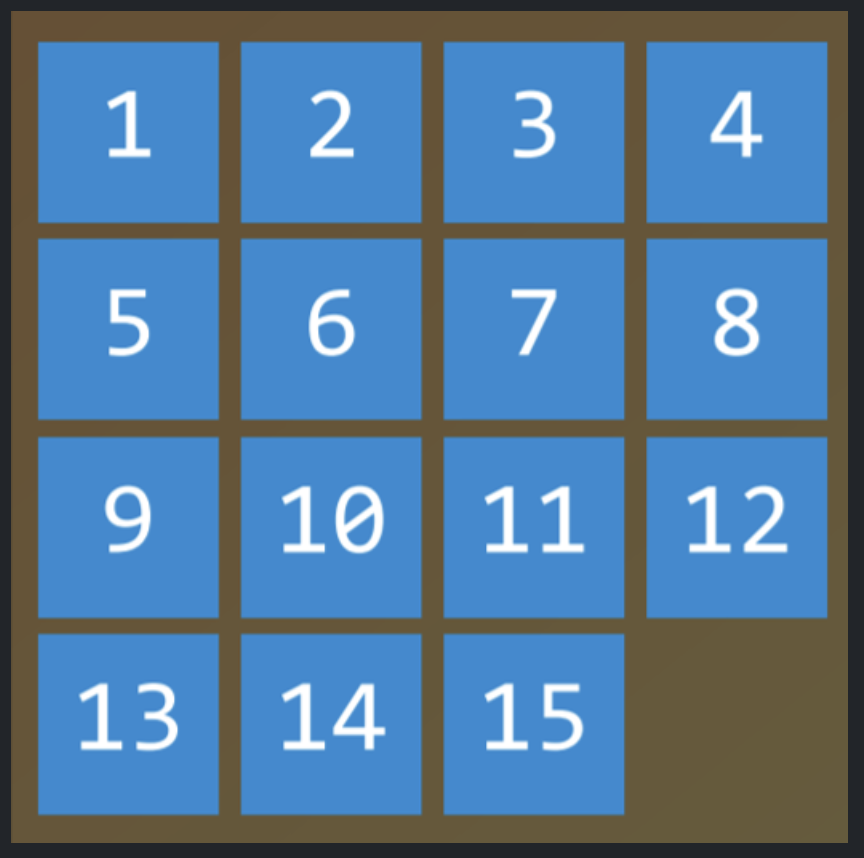
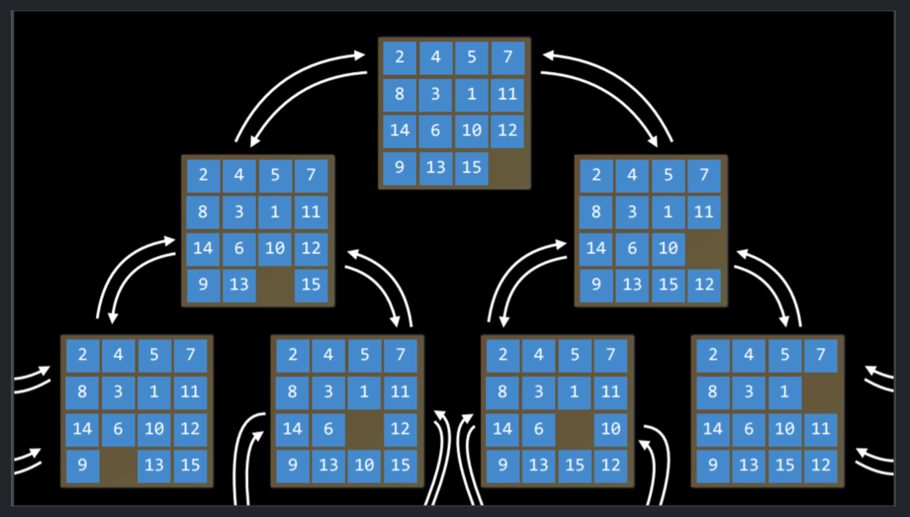

# Lecture 0 — Artificial Intelligence

---

## Artificial Intelligence

Artificial Intelligence (**AI**) covers a range of techniques that appear as *sentient* behavior by the computer. For example, AI is used to recognize faces in photographs on your social media, beat the World’s Champion in chess, and process your speech when you speak to Siri or Alexa on your phone.

In this course, we will explore some of the ideas that make AI possible:

0. **Search**  
   Finding a solution to a problem, like a navigator app that finds the best route from your origin to the destination, or like playing a game and figuring out the next move.

1. **Knowledge**  
   Representing information and drawing inferences from it.

2. **Uncertainty**  
   Dealing with uncertain events using probability.

3. **Optimization**  
   Finding not only a correct way to solve a problem, but a better — or the *best* — way to solve it.

4. **Learning**  
   Improving performance based on access to data and experience. For example, your email is able to distinguish spam from non‑spam mail based on past experience.

5. **Neural Networks**  
   A program structure inspired by the human brain that is able to perform tasks effectively.

6. **Language**  
   Processing natural language, which is produced and understood by humans.

(20251124)

---

## Search

Search problems involve an **agent** that is given an *initial state* and a *goal state*, and it returns a *solution* of how to get from the former to the latter. 
A navigator app uses a typical search process, where the agent (the “thinking” part of the program) receives as input your current location and your desired destination and, based on a search algorithm, returns a suggested path. 
However, there are many other forms of search problems, like puzzles or mazes.


Finding a solution to a **15‑puzzle** would require the use of a search algorithm. To formalize such problems, we introduce several key components (all of these are **core concepts** — <mark>very important</mark>):

<p align="center">
  
</p>

- **Agent**  
  An entity that perceives its environment and acts upon that environment. In a navigator app, for example, the agent would be a representation of a car that needs to decide which actions to take to arrive at the destination.

- **State**  
  A configuration of an agent in its environment. For example, in a 15‑puzzle, a state is any particular arrangement of all the numbers on the board.

  - **Initial State**  
    The state from which the search algorithm starts. In a navigator app, that would be the current location.

- **Actions**  
  Choices that can be made in a state. More precisely, actions can be defined as a function. Upon receiving state *s* as input, `Actions(s)` returns as output the set of actions that can be executed in state *s*.  
  For example, in a 15‑puzzle, the actions of a given state are the different ways you can slide squares in the current configuration (4 if the empty square is in the middle, 3 if it is next to a side, 2 if it is in a corner).

- **Transition Model**  
  A description of what state results from performing any applicable action in any state. More precisely, the transition model can be defined as a function. Upon receiving state *s* and action *a* as input, `Result(s, a)` returns the state resulting from performing action *a* in state *s*.  
  For example, given a certain configuration of a 15‑puzzle (state *s*), moving a square in any direction (action *a*) will bring us to a new configuration of the puzzle (the new state).

- **State Space**  
  The set of all states reachable from the initial state by any sequence of actions. For example, in a 15‑puzzle, the state space consists of all the \(16! / 2\) configurations of the board that can be reached from any initial state. The state space can be visualized as a directed graph with states represented as *nodes* and actions represented as arrows between nodes.

<p align="center">
  
</p>

- **Goal Test**  
  The condition that determines whether a given state is a goal state. For example, in a navigator app, the goal test would be whether the current location of the agent (the representation of the car) is at the destination. 
  
  If it is — problem solved. If it is not — we continue searching.

- **Path Cost**  
  A numerical cost associated with a given path. For example, a navigator app does not simply bring you to your goal; it does so while *minimizing* the path cost, finding the fastest or cheapest way possible for you to get to your goal state.

---

## Solving Search Problems

- **Solution**  
  A sequence of actions that leads from the initial state to the goal state.

  - **Optimal Solution**  
    A solution that has the *lowest path cost* among all possible solutions. This is usually what we want.

In a search process, data is often stored in a **node**, a data structure that contains the following data (this structure is <mark>fundamental</mark> for many search algorithms):

- A **state**  
- Its **parent node**, through which the current node was generated  
- The **action** that was applied to the state of the parent to get to the current node  
- The **path cost** from the initial state to this node  

Nodes contain information that makes them very useful for the purposes of search algorithms. They contain a state, which can be checked using the goal test to see if it is the final state. If it is, the node’s path cost can be compared to other nodes’ path costs, which allows choosing the *optimal* solution. Once the node is chosen, by virtue of storing the parent node and the action that led from the parent to the current node, it is possible to trace back every step of the way from the initial state to this node, and this sequence of actions is the solution.

However, nodes are simply a data structure — they do **not** search; they only hold information. To actually search, we use the **frontier**, the mechanism that “manages” the nodes. The frontier starts by containing an initial state and an empty set of explored items, and then repeats the following actions until a solution is reached:

1. If the frontier is empty,  
   - *Stop.* There is no solution to the problem.
2. Remove a node from the frontier. This is the node that will be considered.
3. If the node contains the goal state,  
   - Return the solution. *Stop.*  
   Else,  
   - *Expand* the node (find all the new nodes that could be reached from this node), and add the resulting nodes to the frontier.  
   - Add the current node to the explored set.

(20251125)

---

## Depth‑First Search (DFS)

In the previous description of the frontier, one thing went unmentioned: at step 2 in the pseudocode above, **which node should be removed?** This choice has implications for the quality of the solution and how fast it is achieved. There are multiple ways to answer the question of which nodes should be considered first. Two important strategies can be represented by the data structures of a **stack** (in depth‑first search) and a **queue** (in breadth‑first search); there is even a cute cartoon demonstration of the difference between the two.

We start with the **depth‑first search (DFS)** approach.

A depth‑first search algorithm explores one direction as far as possible *before* trying another direction. In these cases, the frontier is managed as a **stack** data structure. The catchphrase you need to remember here is <mark>*last‑in first‑out*</mark>. After nodes are added to the frontier, the first node to remove and consider is the *last* one that was added. This results in a search algorithm that goes as deep as possible in the first direction that gets in its way, while leaving all other directions for later.

*(Example from outside the lecture)*:  
Imagine you are looking for your keys. In a depth‑first search approach, if you choose to start with searching in your pants, you would first go through **every single pocket**, emptying each pocket and going through the contents carefully. You will stop searching in your pants and start searching elsewhere only once you have *completely exhausted* the search in every pocket of your pants.

**Pros of DFS**

- At best, this algorithm is the *fastest*. If it “lucks out” and always chooses the right path to the solution (by chance), then depth‑first search takes the least possible time to get to a solution.

**Cons of DFS**

- It is possible that the found solution is **not optimal**.  
- At worst, this algorithm will explore **every possible path** before finding the solution, thus taking the *longest* possible time before reaching the solution.

**Code example (DFS frontier `remove`):**

```python
# Define the function that removes a node from the frontier and returns it.
def remove(self):
    # Terminate the search if the frontier is empty,
    # because this means that there is no solution.
    if self.empty():
        raise Exception("empty frontier")
    else:
        # Save the last item in the list (which is the newest node added)
        node = self.frontier[-1]
        # Save all the items in the list besides the last node
        # (i.e., removing the last node)
        self.frontier = self.frontier[:-1]
        return node
```

---

## Breadth‑First Search (BFS)

The opposite of depth‑first search is **breadth‑first search (BFS)**.

A breadth‑first search algorithm will follow *multiple directions at the same time*, taking one step in each possible direction before taking the second step in each direction. In this case, the frontier is managed as a **queue** data structure. The catchphrase you need to remember here is <mark>*first‑in first‑out*</mark>. All the new nodes line up in order, and nodes are considered based on which one was added first (*first come first served*). This results in a search algorithm that takes one step in each possible direction before taking a second step in any one direction.

*(Example from outside the lecture)*:  
Suppose you are in a situation where you are looking for your keys. With a breadth‑first approach, if you start with your pants, you will look in your right pocket first. After this, instead of immediately looking in your left pocket, you will take a look in one drawer. Then on the table. And so on, in every location you can think of. Only after you have exhausted all the locations will you go back to your pants and search in the next pocket.

**Pros of BFS**

- This algorithm is **guaranteed** to find the *optimal* solution (assuming all step costs are equal).

**Cons of BFS**

- This algorithm is almost guaranteed to take *longer* than the minimal time to run.  
- At worst, this algorithm takes the **longest possible time** to run.

**Code example (BFS frontier `remove`):**

```python
# Define the function that removes a node from the frontier and returns it.
def remove(self):
    # Terminate the search if the frontier is empty,
    # because this means that there is no solution.
    if self.empty():
        raise Exception("empty frontier")
    else:
        # Save the oldest item in the list (which was the first one added)
        node = self.frontier[0]
        # Save all the items on the list besides the first one
        # (i.e., removing the first node)
        self.frontier = self.frontier[1:]
        return node
```

---

## Greedy Best‑First Search

Breadth‑first and depth‑first are both **uninformed search** algorithms. That is, these algorithms do *not* utilize any knowledge about the problem that they did not acquire through their own exploration.

However, very often some knowledge about the problem *is* available. For example, when a human maze‑solver enters a junction, the human can see which way goes in the general direction of the solution and which way does not. AI can do the same. A type of algorithm that considers additional knowledge to try to improve its performance is called an **informed search** algorithm.

**Greedy best‑first search** expands the node that seems closest to the goal, as determined by a heuristic function \(h(n)\). As its name suggests, the function *estimates* how close to the goal the next node is — but it can be mistaken.

The efficiency of the greedy best‑first algorithm depends on how good the heuristic function is. For example, in a maze, an algorithm can use a heuristic function based on the **Manhattan distance** between the possible nodes and the end of the maze. The Manhattan distance ignores walls and simply counts how many steps up, down, left, or right it would take to get from one location to the goal location. This is an easy estimation that can be derived from the \((x, y)\) coordinates of the current location and the goal location.

<mark>Heuristics = educated guesses about distance to the goal.</mark>

However, it is important to emphasize that, as with any heuristic, it can go wrong and lead the algorithm down a *slower* path than it would have gone otherwise. It is possible that an **uninformed** search algorithm will provide a better solution faster, but it is less likely to do so than an **informed** algorithm.

---

## A* Search

A development of the greedy best‑first algorithm, **A\*** search considers not only \(h(n)\), the *estimated* cost from the current location to the goal, but also \(g(n)\), the cost that has been accrued up to the current location.

By combining both these values, the algorithm has a more accurate way of determining the cost of the solution and optimizing its choices on the go. The algorithm keeps track of

\[
f(n) = g(n) + h(n)
\]

which is the **estimated total path cost**. Once \(f(n)\) for the current path exceeds the estimated cost of some previous option, the algorithm will *abandon* the current path and go back to the previous option, thus preventing itself from going down a long, inefficient path that \(h(n)\) alone might have erroneously marked as best.

Yet again, since this algorithm also relies on a heuristic, it is only as good as the heuristic that it employs. It is possible that in some situations it will be less efficient than greedy best‑first search or even than the uninformed algorithms.

For A\* search to be **optimal**, the heuristic function \(h(n)\) should be:

1. **Admissible** — it never *overestimates* the true cost.  
2. **Consistent (monotonic)** — the estimated path cost to the goal of a new node plus the cost of transitioning to it from the previous node is *greater than or equal to* the estimated path cost to the goal of the previous node.  

   In equation form, \(h(n)\) is consistent if for every node \(n\) and successor node \(n'\) with step cost \(c\),

   \[
   h(n) \leq h(n') + c.
   \]

---

## Adversarial Search

Previously, we discussed algorithms that need to find an answer to a question in a *static* environment. In **adversarial search**, the algorithm faces an **opponent** that tries to achieve the *opposite* goal.

Often, AI that uses adversarial search is encountered in games, such as tic‑tac‑toe or chess.

---

## Minimax

A key algorithm in adversarial search is **Minimax**. It represents winning conditions as **−1** for one side and **+1** for the other side. Further actions are driven by these conditions:

- the *minimizing* side tries to get the **lowest** score;
- the *maximizing* side tries to get the **highest** score.

### Representing a Tic‑Tac‑Toe AI

We can formalize tic‑tac‑toe using the following components (again, all of these are <mark>core ideas</mark>):

- **S₀**: Initial state (in our case, an empty 3×3 board).  
- `Player(s)`: A function that, given a state *s*, returns which player’s turn it is (X or O).  
- `Actions(s)`: A function that, given a state *s*, returns all the legal moves in this state (what spots are free on the board).  
- `Result(s, a)`: A function that, given a state *s* and action *a*, returns a new state. This is the board that results from performing action *a* on state *s* (making a move in the game).  
- `Terminal(s)`: A function that, given a state *s*, checks whether this is the last step in the game, i.e., whether someone won or there is a tie. Returns `True` if the game has ended, `False` otherwise.  
- `Utility(s)`: A function that, given a terminal state *s*, returns the utility value of the state: **−1**, **0**, or **+1**.

### How the Minimax Algorithm Works

Recursively, the algorithm simulates **all possible games** that can take place beginning at the current state and continuing until a terminal state is reached. Each terminal state is valued as either −1, 0, or +1.

Knowing whose turn it is in a given state, the algorithm can determine whether the current player, when playing optimally, will pick the action that leads to a state with a lower or higher value. Alternating between *minimizing* and *maximizing*, the algorithm creates values for the states that would result from each possible action.

A more concrete way to think about it:

- The maximizing player asks at every turn:  
  *“If I take this action, a new state will result. If the minimizing player then plays optimally, what action can that player take that brings the value to the lowest possible number?”*
- To answer this, the maximizing player has to simulate the minimizing player’s reasoning:  
  *“If I (the minimizing player) take this action, what action can the maximizing player then take that brings the value to the highest possible number?”*

This back‑and‑forth reasoning continues *recursively* until terminal states are reached. Eventually, through this process, the maximizing player generates values for each state that could result from all possible actions at the current state. After obtaining these values, the maximizing player chooses the action with the **highest** value.

### Minimax Pseudocode

Visually, the maximizer considers the **possible values of future states**.

In pseudocode, the Minimax algorithm works as follows:

- **Given a state `s`:**
  - The *maximizing* player picks action `a` in `Actions(s)` that produces the highest value of  
    `Min-Value(Result(s, a))`.
  - The *minimizing* player picks action `a` in `Actions(s)` that produces the lowest value of  
    `Max-Value(Result(s, a))`.

- **Function `Max-Value(state)`**

```python
def max_value(state):
    v = float("-inf")
    if Terminal(state):
        return Utility(state)
    for action in Actions(state):
        v = max(v, min_value(Result(state, action)))
    return v
```

- **Function `Min-Value(state)`**

```python
def min_value(state):
    v = float("inf")
    if Terminal(state):
        return Utility(state)
    for action in Actions(state):
        v = min(v, max_value(Result(state, action)))
    return v
```

---

## Alpha–Beta Pruning

A way to **optimize** Minimax is **Alpha–Beta Pruning**. It skips some of the recursive computations that are clearly unfavorable.

After establishing the value of one action, if there is early evidence that some *other* action can bring the opponent to a *better* score than the already established action, there is no need to further investigate this action — it will definitely be less favorable than the previously established one. In other words, we *prune* (cut off) branches of the search tree that cannot possibly influence the final decision.

This is best shown with an example:

A maximizing player knows that, at the next step, the minimizing player will try to achieve the **lowest** score. Suppose the maximizing player has three possible actions, and the first one is valued at **4**. Then the player starts computing the value for the next action. To do this, the player generates the values of the minimizer’s actions if the current player chooses this action, knowing that the minimizer will choose the **lowest** one.

However, before finishing the computation for all the possible actions of the minimizer, the player sees that one of the options has a value of **3**. This means there is no reason to keep exploring the other possible actions for the minimizing player:

- If the not‑yet‑valued action turns out to be **10**, the minimizer will still choose **3**, which is already worse for the maximizer than the pre‑established **4**.
- If the not‑yet‑valued action turns out to be **−10**, the minimizer will choose **−10**, which is even more unfavorable for the maximizer.

Therefore, computing additional possible actions for the minimizer at this point is **irrelevant** to the maximizer, because the maximizing player already has an unequivocally better choice whose value is 4.

<mark>Alpha–Beta Pruning = avoid exploring branches that cannot improve the outcome.</mark>

---

## Depth‑Limited Minimax

There are about **255,168** possible Tic‑Tac‑Toe games and roughly **10¹²⁰** possible games in Chess. The Minimax algorithm, as presented so far, requires generating **all** hypothetical games from a certain point to the terminal condition.

While computing all the Tic‑Tac‑Toe games does not pose a challenge for a modern computer, doing so for Chess is currently impossible.

To address this, **Depth‑Limited Minimax** considers only a *pre‑defined number of moves* before it stops, without ever getting to a terminal state. However, this means we cannot get a precise value for each action, since the end of the hypothetical game has not yet been reached.

To deal with this problem, Depth‑Limited Minimax relies on an **evaluation function** that *estimates* the expected utility of the game from a given state — in other words, it assigns values to states.

For example, in a chess game, such a utility function would:

1. Take as input a current configuration of the board.  
2. Try to **assess** its expected utility (based on what pieces each player has and where they are located on the board).  
3. Return a **positive** value if the board is favorable for one player, or a **negative** value if it is favorable for the other.

These values can then be used to decide on the right action. The better the evaluation function, the better the Minimax‑based algorithm that relies on it.

---
