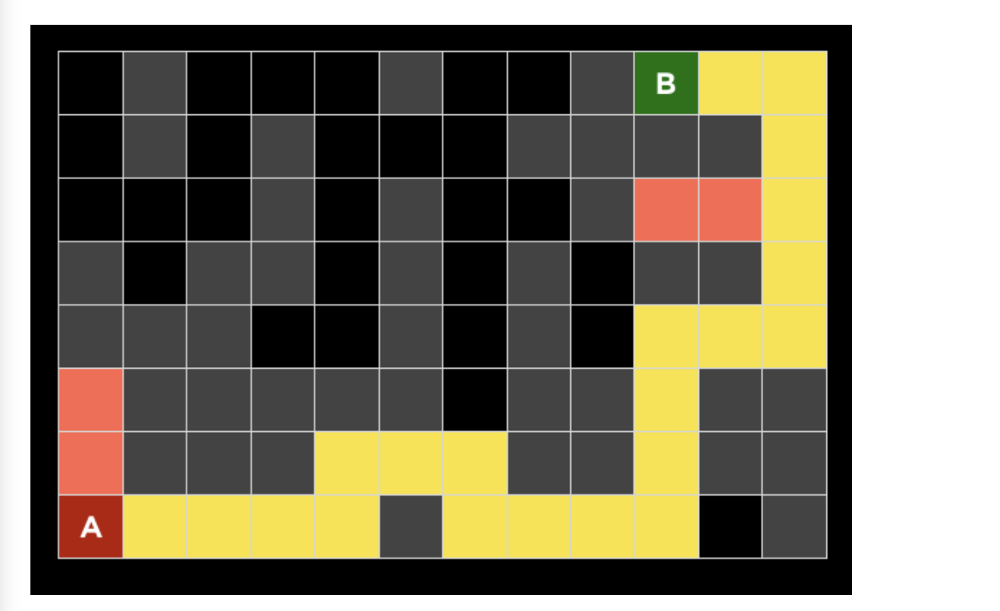
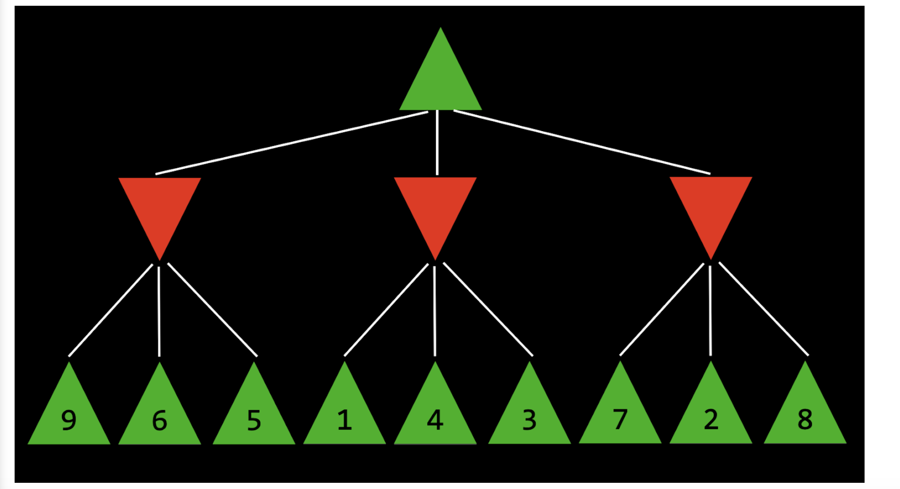

# Lecture 0 — Quiz 0 (Search in Artificial Intelligence)

## Overview

Quizzes are *optional but encouraged*. They help test conceptual understanding before moving to programming projects.

---

# Question 1

**Between Depth First Search (DFS) and Breadth First Search (BFS), which will find a shorter path through a maze?**

Options:
- DFS will always find a shorter path than BFS  
- BFS will always find a shorter path than DFS  
- DFS will sometimes, but not always, find a shorter path than BFS  
- BFS will sometimes, but not always, find a shorter path than DFS  
- Both algorithms will always find paths of the same length  

### Answer:
**✔ BFS will sometimes, but not always, find a shorter path than DFS**

### why:
BFS explores nodes level by level, so it guarantees the shortest path in an unweighted maze, whereas DFS may find a longer path first.

---

# Question 2

A search algorithm was run on a maze. Grey cells are walls. Yellow is the solution path. Red cells are explored but not part of the solution.

Which algorithm(s) could have produced this result?

Options:
- Could only be A*  
- Could only be greedy best-first search  
- Could only be DFS  
- Could only be BFS  
- Could be either A* or greedy best-first search  
- Could be either DFS or BFS  
- Could be any of the four algorithms  
- Could not be any of the four algorithms  

### Answer:
**✔ Could only be DFS**

### Why:
Only DFS fits this pattern because it explores deeply along one branch, backtracks from dead ends (red cells), and eventually finds a non-shortest path (yellow), whereas BFS, Greedy Best-First Search, and A* would explore very different states and typically find a shorter or more goal-directed path.

The dead-end explorations and non-optimal final path are characteristic of DFS's deep exploration and backtracking behavior.

---

# Question 3

Why is depth-limited minimax sometimes preferable to minimax without a depth limit?

Options:
- Depth-limited minimax can arrive at a decision more quickly because it explores fewer states  
- Depth-limited minimax will achieve the same output as minimax without a depth limit, but can sometimes use less memory  
- Depth-limited minimax can make a more optimal decision by not exploring suboptimal states  
- Depth-limited minimax is never preferable  

### Answer:
**✔ Depth-limited minimax can arrive at a decision more quickly because it explores fewer states**

### Why:
Depth-limited minimax is often preferred because it evaluates fewer game states, allowing it to make decisions much faster when the full game tree is too large to search completely.

Depth-limited minimax is faster because it explores fewer states.

---

# Question 4

Consider the Minimax tree below, where the green up arrows indicate the MAX player and red down arrows indicate the MIN player. The leaf nodes are each labelled with their value.

Minimax tree: compute root value.

Leaf values:
- Left: 9, 6, 5  
- Middle: 1, 4, 3  
- Right: 7, 2, 8  

### Step:
- MIN nodes:
  - min(9,6,5) = 5  
  - min(1,4,3) = 1  
  - min(7,2,8) = 2  

- MAX root:
  - max(5,1,2) = 5 

What is the value of the root node?

### Answer:
**✔ 5**

### Why:
Each MIN node chooses the smallest value among its children (5, 1, and 2), then the root MAX node chooses the largest of those values, so the root value is 5.

---
