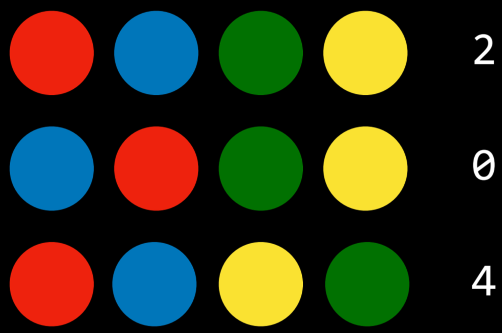

# Lecture 1 — Knowledge (CS50 AI)

---

## 📌 Overview

<span style="background-color:#fff3b0"><b>Knowledge in AI (Lecture 1)</b></span>

Humans reason based on existing knowledge and draw conclusions.  
This lecture explores how AI can represent knowledge and use it to infer new information.

---

## 1.  🧠 Knowledge-Based Agents

Knowledge-based agents are systems that reason by operating on **internal representations of knowledge**.

### ❓ Core Question
What does *“reasoning based on knowledge to draw conclusions”* mean?

---

### 🧪 Example (Harry Potter Logic)

Consider the following statements:

1. If it didn’t rain, Harry visited Hagrid today.  
2. Harry visited Hagrid or Dumbledore today, but not both.  
3. Harry visited Dumbledore today.  

From these, we can infer:

- From (3): Harry visited Dumbledore  
- From (2): Therefore, Harry did NOT visit Hagrid  
- From (1): Therefore, it must have rained  

### ✅ Final Conclusion:
<span style="background-color:#fff3b0"><b>It rained today.</b></span>

To come to this conclusion, we used logic, and today’s lecture explores how AI can use logic to reach to new conclusions based on existing information.

---

### 📖 Sentence

A sentence is an assertion about the world in a knowledge representation language.  
AI uses sentences to store knowledge and infer new information.

---

## 2.  🧮 Propositional Logic

Propositional logic consists of statements that are either **true or false**.

### 🔤 Propositional Symbols
Common symbols: P, Q, R

They represent propositions about the world.

---

### 🔗 Logical Connectives

Logical connectives are logical symbols that connect propositional symbols in order to reason in a more complex way about the world.

### NOT (¬)
- Inverts truth value  
- If P: “It is raining” → ¬P: “It is not raining”

Truth tables are used to compare all possible truth assignments to propositions. This tool will help us better understand the truth values of propositions when connected with different logical connectives. For example, below is our first truth table:

Truth table:

| P | ¬P |
|---|---|
| F | T |
| T | F |

---

### AND (∧)

P ∧ Q is true only if BOTH are true.

| P | Q | P ∧ Q |
|---|---|------|
| F | F | F |
| F | T | F |
| T | F | F |
| T | T | T |

---

### OR (∨)

True if at least one is true.

| P | Q | P ∨ Q |
|---|---|------|
| F | F | F |
| F | T | T |
| T | F | T |
| T | T | T |

- Inclusive OR is used in AI
- Exclusive OR (XOR) requires only one true

It is worthwhile to mention that there are two types of Or: an inclusive Or and an exclusive Or. In an exclusive Or, P ∨ Q is false if P ∧ Q is true. That is, an exclusive Or requires only one of its arguments to be true and not both.

An inclusive Or is true if any of P, Q, or P ∧ Q is true. In the case of Or (∨), the intention is an inclusive Or.

A couple of side notes not mentioned in lecture:

```
- Sometimes an example helps understand inclusive versus exclusive Or. Inclusive Or: “in order to eat dessert, you have to clean your room or mow the lawn.” In this case, if you do both chores, you will still get the cookies.

- Exclusive Or: “For dessert, you can have either cookies or ice cream.” In this case, you can’t have both.

- If you are curious, the exclusive Or is often shortened to XOR and a common symbol for it is ⊕).
```
---

### IMPLICATION (→)

P → Q means “if P then Q”

Implication (→) represents a structure of “if P then Q.” For example, if P: “It is raining” and Q: “I’m indoors”, then P → Q means “If it is raining, then I’m indoors.” In the case of P implies Q (P → Q), P is called the antecedent and Q is called the consequent.

- False only when P is true and Q is false
- Otherwise true (trivially true if P is false)

| P | Q | P → Q |
|---|---|------|
| F | F | T |
| F | T | T |
| T | F | F |
| T | T | T |

The example:

When the antecedent is true, the whole implication is true in the case that the consequent is true (that makes sense: if it is raining and I’m indoors, then the sentence “if it is raining, then I’m indoors” is true). When the antecedent is true, the implication is false if the consequent is false (if I’m outside while it is raining, then the sentence “If it is raining, then I’m indoors” is false). However, when the antecedent is false, the implication is always true, regardless of the consequent. This can sometimes be a confusing concept. Logically, we can’t learn anything from an implication (P → Q) if the antecedent (P) is false. Looking at our example, if it is not raining, the implication doesn’t say anything about whether I’m indoors or not.

I could be an indoors type and never walk outside, even when it is not raining, or I could be an outdoors type and be outside all the time when it is not raining.

When the antecedent is false, we say that the implication istrivially true.

---

### BICONDITIONAL (↔)

Biconditional (↔) is an implication that goes both directions. You can read it as “if and only if.” P ↔ Q is the same as P → Q and Q → P taken together. For example, if P: “It is raining.” and Q: “I’m indoors,” then P ↔ Q means that “If it is raining, then I’m indoors,” and “if I’m indoors, then it is raining.” This means that we can infer more than we could with a simple implication. If P is false, then Q is also false; if it is not raining, we know that I’m also not indoors.

P ↔ Q means both directions:

P → Q AND Q → P

| P | Q | P ↔ Q |
|---|---|------|
| F | F | T |
| F | T | F |
| T | F | F |
| T | T | T |

---

### 🧠 Model

A model is an assignment of truth values to propositions.

- The model is an assignment of a truth value to every proposition. To reiterate, propositions are statements about the world that can be either true or false. However, knowledge about the world is represented in the truth values of these propositions.


Example:
- P = True (It is raining)
- Q = False (It is Tuesday)

Total models = 2ⁿ (n = number of propositions)

For example, if P: “It is raining.” and Q: “It is Tuesday.”, a model could be the following truth-value assignment: {P = True, Q = False}. This model means that it is raining, but it is not Tuesday.

However, there are more possible models in this situation (for example, {P = True, Q = True}, where it is both raining and a Tuesday). In fact, the number of possible models is 2 to the power of the number of propositions.

In this case, we had 2 propositions, so 2²=4 possible models.

---

### 📚 Knowledge Base (KB)

A knowledge base is a set of sentences known to the AI agent.

Used to make logical inferences.

- The knowledge base is a set of sentences known by a knowledge-based agent. This is knowledge that the AI is provided about the world in the form of propositional logic sentences that can be used to make additional inferences about the world.

---

### 📌 Entailment (⊨)

α ⊨ β means:
> In every model where α is true, β is also true.

- For example, if α: “It is a Tuesday in January” and β: “It is January,” then we know that α ⊨ β. If it is true that it is a Tuesday in January, we also know that it is January. Entailment is different from implication. Implication is a logical connective between two propositions.
- Entailment, on the other hand, is a relation that means that if all the information in α is true, then all the information in β is true.
  
---

## 3. 🔍 Inference

Inference is the process of deriving new sentences from old ones.

In the Harry Potter example earlier, sentences 4 and 5 are derived from sentences 1, 2, and 3.

There are multiple ways to infer new knowledge based on existing knowledge. First, we will consider the Model Checking algorithm.

---

### 🔍 Model Checking Algorithm

To determine whether **KB ⊨ α** (in other words, answering the question: “can we conclude that α is true based on our knowledge base”):

- Enumerate all possible models
- If in every model where KB is true, α is also true
- Then KB entails α

---

### 📌 Example Setup

- P: It is a Tuesday  
- Q: It is raining  
- R: Harry will go for a run  

KB:
> (P ∧ ¬Q) → R   
>Query: R   
>(We want to know whether R is true or false; Does KB ⊨ R?)

>(in words, P and not Q imply R) 
 P (P is true) ¬Q (Q is false)

To answer the query using the Model Checking algorithm, We enumerate all possible models:

| P | Q | R |
|---|---|---|
| F | F | F |
| F | F | T |
| F | T | F |
| F | T | T |
| T | F | F |
| T | F | T |
| T | T | F |
| T | T | T |

Then, we go through every model and check whether it is true given our Knowledge Base.

---

### 🧾 Applying KB constraints

#### Step 1: P is true in KB
So all models where P is false are invalid. Thus, we can say that the KB is false in all models where P is not true.

---

#### Step 2: Q is false in KB
In our KB, we know that Q is false. Thus, we can say that the KB is false in all models where Q is true.

Remaining models:

- P = True
- Q = False
- R = {True, False}

---

#### Step 3: Apply rule (P ∧ ¬Q → R)

- Due to (P ∧ ¬Q) → R being in our KB, we know that in the case where P is true and Q is false, R must be true.

- Only models where R is true satisfy KB.

---

### 📌 Final conclusion

Only one model satisfies KB:
- P = True
- Q = False
- R = True

So:

<span style="background-color:#fff3b0"><b>KB ⊨ R</b></span>

---

### 💻 Code Representation

```python
from logic import *

# Create new classes, each having a name, or a symbol, representing each proposition.
rain = Symbol("rain")  # It is raining.
hagrid = Symbol("hagrid")  # Harry visited Hagrid
dumbledore = Symbol("dumbledore")  # Harry visited Dumbledore

# Save sentences into the KB
knowledge = And(  # Starting from the "And" logical connective, becasue each proposition represents knowledge that we know to be true.

    Implication(Not(rain), hagrid),  # ¬(It is raining) → (Harry visited Hagrid)

    Or(hagrid, dumbledore),  # (Harry visited Hagrid) ∨ (Harry visited Dumbledore).

    Not(And(hagrid, dumbledore)),  # ¬(Harry visited Hagrid ∧ Harry visited Dumbledore) i.e. Harry did not visit both Hagrid and Dumbledore.

    dumbledore  # Harry visited Dumbledore. Note that while previous propositions contained multiple symbols with connectors, this is a proposition consisting of one symbol. This means that we take as a fact that, in this KB, Harry visited Dumbledore.
    )
```

---


To run the Model Checking algorithm, the following information is needed:

- Knowledge Base, which will be used to draw inferences
- A query, or the proposition that we are interested in whether it is entailed by the KB
- Symbols, a list of all the symbols (or atomic propositions) used (in our case, these are rain, hagrid, and dumbledore)
- Model, an assignment of truth and false values to symbols

The model checking algorithm looks as follows:

### 🔁 Model Checking Function

```python
def check_all(knowledge, query, symbols, model):

    # If model has an assignment for each symbol
    # (The logic below might be a little confusing: we start with a list of symbols. The function is recursive, and every time it calls itself it pops one symbol from the symbols list and generates models from it. Thus, when the symbols list is empty, we know that we finished generating models with every possible truth assignment of symbols.)
    if not symbols:

        # If knowledge base is true in model, then query must also be true
        if knowledge.evaluate(model):
            return query.evaluate(model)
        return True
    else:

        # Choose one of the remaining unused symbols
        remaining = symbols.copy()
        p = remaining.pop()

        # Create a model where the symbol is true
        model_true = model.copy()
        model_true[p] = True

        # Create a model where the symbol is false
        model_false = model.copy()
        model_false[p] = False

        # Ensure entailment holds in both models
        return(check_all(knowledge, query, remaining, model_true) and check_all(knowledge, query, remaining, model_false))
```

---

### ⚠️ Key Insight

We only care about models where KB is true.
- Note that we are interested only in the models where the KB is true. If the KB is false, then the conditions that we know to be true are not occurring in these models, making them irrelevant to our case.

an example:

Let P: Harry plays seeker, Q: Oliver plays keeper, R: Gryffindor wins. Our KB specifies that P Q (P ∧ Q) → R. In other words, we know that P is true, i.e. Harry plays seeker, and that Q is true, i.e. Oliver plays keeper, and that if both P and Q are true, then R is true, too, meaning that Gryffindor wins the match. 

Now imagine a model where Harry played beater instead of seeker (thus, Harry did not play seeker, ¬P). Well, in this case, we don’t care whether Gryffindor won (whether R is true or not), because we have the information in our KB that Harry played seeker and not beater. We are only interested in the models where, as in our case, P and Q are true.)

an notes:

Further, the way the check_all function works is recursive. That is, it picks one symbol, creates two models, in one of which the symbol is true and in the other the symbol is false, and then calls itself again, now with two models that differ by the truth assignment of this symbol.

The function will keep doing so until all symbols will have been assigned truth-values in the models, leaving the listsymbols empty. Once it is empty (as identified by the line if not symbols), in each instance of the function (wherein each instance holds a different model), the function checks whether the KB is true given the model. If the KB is true in this model, the function checks whether the query is true, as described earlier.

---

### 🎯 Summary

<span style="background-color:#fff3b0"><b>Inference = reasoning by checking all possible models consistent with knowledge.</b></span>

## 4. 🧠 Knowledge Engineering

Knowledge engineering is the process of figuring out how to represent propositions and logic in AI.

We practice it using the game **Clue**.

---

### 🎮 Clue Game Model

In the game:
- A murder is committed by a **person**
- Using a **tool**
- In a **location**

Cards represent:
- People
- Tools
- Locations

One card from each category is placed in an envelope.

We will use the Model Checking algorithm from before to uncover the mystery.

In our model, we mark as **True** items that we know are related to the murder and **False** otherwise.

### Goal:
Determine **who did it, with what tool, and where**.

---

### 📌 Modeling Assumption

We mark:
- <mark>True</mark> → related to murder
- <mark>False</mark> → not related

---

### 👥 Example Setup

People:
- Mustard
- Plum
- Scarlet

Tools:
- Knife
- Revolver
- Wrench

Locations:
- Ballroom
- Kitchen
- Library

---

### 📐 Knowledge Base Rules

Exactly one from each category is true:

- (Mustard ∨ Plum ∨ Scarlet)
- (Knife ∨ Revolver ∨ Wrench)
- (Ballroom ∨ Kitchen ∨ Library)

---

### 🃏 Observed Cards

Let's start to paly together. Suppose our player gets the cards of Mustard, kitchen, and revolver.:

Player sees:
- Mustard
- Kitchen
- Revolver

So we add:

- ¬Mustard
- ¬Kitchen
- ¬Revolver

---

### 🧪 Guess Constraint

In other situations in the game, one can make a guess, suggesting one combination of person, tool and location. 

Suppose that the guess is that **Scarlet used a wrench to commit the crime in the library**. If this guess is wrong, then the following can be deduced and added to the KB:

If guess is wrong:

Scarlet + Library + Wrench

→ At least one is false:

<span style="background-color:#fff3b0"><b>(¬Scarlet ∨ ¬Library ∨ ¬Wrench)</b></span>

---

### 🧾 Additional Evidence

Now, suppose someone shows us the Plum card. Thus, we can add

If Plum card is shown:

- ¬Plum

Adding just one more piece of knowledge, for example, that it is not the ballroom, can give us more information. First, we update our KB

If not ballroom:

- ¬Ballroom

---

### 🧠 Final Deduction

Using all constraints:

We conclude:

<span style="background-color:#fff3b0"><b>Scarlet committed the murder in the library using the knife.</b></span>

Why:

We can deduce that it’s the library because it has to be either the ballroom, the kitchen, or the library, and the first two were proven to not be the locations. However, when someone guessed Scarlet, library, wrench, the guess was false.

Thus, at least one of the elements in this statement has to be false. Since we know both Scarlet and library to be true, we know that the wrench is the false part here.

Since one of the three instruments has to be true, and it’s not the wrench nor the revolver, we can conclude that it is the knife.

---

### 💻 Python Knowledge Base

Here is how the information would be added to the knowledge base in Python:

```python
# Add the clues to the KB
knowledge = And(

    # Start with the game conditions: one item in each of the three categories has to be true.
    Or(mustard, plum, scarlet),
    Or(ballroom, kitchen, library),
    Or(knife, revolver, wrench),

    # Add the information from the three initial cards we saw
    Not(mustard),
    Not(kitchen),
    Not(revolver),

    # Add the guess someone made that it is Scarlet, who used a wrench in the library
    Or(Not(scarlet), Not(library), Not(wrench)),

    # Add the cards that we were exposed to
    Not(plum),
    Not(ballroom)
)
```

---

### 🧩 Other Logic Puzzles

### House Assignment Problem

- 4 people
- 4 houses

Encoding is complex:
- Each assignment becomes a proposition
- Requires many OR constraints
- Requires mutual exclusion rules

👉 This motivates **First Order Logic**

---

### 🎯 Mastermind Game

Game idea:
- Guess color order
- Receive feedback (how many correct positions)

In this game, player one arranges colors in a certain order, and then player two has to guess this order.

Each turn, player two makes a guess, and player one gives back a number, indicating how many colors player two got right. Let’s simulate a game with four colors.

Example:
- Guess → "2 correct"
- Swap → "0 correct"
- Final → "4 correct"

---

### ♟️ Play

1. Suppose player two suggests the following ordering:


Player one answers “two.” Thus we know that some two of the colors are in the correct position, and the other two are in the wrong place. 

2. Based on this information, player two tries to switch the locations of two colors.


Now player one answers “zero.” Thus, player two knows that the switched colors were in the right location initially, which means the untouched two colors were in the wrong location. 

3. Player two switches them.




Player one says “four” and the game is over.


### 🔢 Logical Encoding

For 4 colors:
- Need (number_of_colors)² propositions
- e.g. red0, red1, red2, red3, blue0… Standing for color and position

The next step is to represent the rules of the game in propositional logic
Rules:
- One color per position
- No repetition

The final step would be adding all the cues that we have to the KB.

Using this knowledge, a Model Checking algorithm can give us the solution to the puzzle.

---

### 🧠 Key Insight

<span style="background-color:#fff3b0"><b>All constraints + observations → can be solved using Model Checking</b></span>

---

## 4. 🧠 Inference Rules

**Model Checking is not an efficient algorithm** because it must evaluate every possible model before producing an answer.

A query **R is true** if it is true in **all models where the KB is true**.

Inference rules allow us to generate new information based on existing knowledge without considering every possible model.

---

### 📌 Structure of Inference Rules

Inference rules are written as:


Inference rules are usually represented using **a horizontal bar** that separates **the top part, the premise**, from the **bottom part, the conclusion**. The premise is whatever knowledge we have, and the conclusion is what knowledge can be generated based on the premise.

- Top: **premise**
- Bottom: **conclusion**

---

### 🔥 Example (Modus Ponens)

> If it is raining, then Harry is inside.  
> It is raining.  
> Therefore, Harry is inside.

### Premises:
- If raining → Harry inside
- It is raining

### Conclusion:
- Harry is inside

---

### 📘 Modus Ponens

which is a fancy way of saying that if we know an implication and its antecedent to be true, then the consequent is true as well.


If:
- α → β
- α is true

Then:
- β is true

---

### ➗ AND Elimination
If an And proposition is true, then any one atomic proposition within it is true as well.


If:
- α ∧ β is true

Then:
- α is true
- β is true

Example:
If Harry is friends with Ron AND Hermione → he is friends with Hermione.

---

### ❌ Double Negation Elimination
A proposition that is negated twice is true.


¬(¬α) ≡ α

Example:
“Not true that Harry did not pass” → Harry passed.

 We can parse it the following way: “It is not true that (Harry did not pass the test)”, or “¬(Harry did not pass the test)”, and, finally “¬(¬(Harry passed the test)).” 
 
 The two negations cancel each other, marking the proposition “Harry passed the test” as true.

---

### ➡️ Implication Elimination
An implication is equivalent to an Or relation between the negated antecedent and the consequent. 


α → β ≡ ¬α ∨ β

Truth intuition:
- If α is false → implication is true
- If β is true → implication is true

---

This one can be a little confusing. However, consider the following truth table:

### 🔢 Truth Table Equivalence

| P | Q | P→Q | ¬P∨Q |
|---|---|-----|------|
| F | F | T   | T    |
| F | T | T   | T    |
| T | F | F   | F    |
| T | T | T   | T    |

Since P → Q and ¬P ∨ Q have the same truth-value assignment, we know them to be equivalent logically.

Another way to think about this is that an implication is true if either of two possible conditions is met: first, if the antecedent is false, the implication is trivially true (as discussed earlier, in the section on implication).

This is represented by the negated antecedent P in ¬P ∨ Q, meaning that the proposition is always true if P is false. Second, the implication is true when the antecedent is true only when the consequent is true as well. That is, if P and Q are both true, then ¬P ∨ Q is true.

However, if P is true and Q is not, then ¬P ∨ Q is false.


---

### ↔ Biconditional Elimination
A biconditional proposition is equivalent to an implication and its inverse with an And connective.


α ↔ β ≡ (α → β) ∧ (β → α)

Example:
“If and only if” statements split into two implications. 

For example, “It is raining if and only if Harry is inside” is equivalent to (“If it is raining, Harry is inside” And “If Harry is inside, it is raining”).

---

### 📉 De Morgan’s Laws

It is possible to turn an And connective into an Or connective. 

Consider the following proposition: “It is not true that both Harry and Ron passed the test.
#### Negation of AND:
¬(α ∧ β) ≡ ¬α ∨ ¬β


From this, it is possible to conclude that “It is not true that Harry passed the test” Or “It is not true that Ron passed the test.” That is, for the And proposition earlier to be true, at least one of the propositions in the Or propositions must be true.

#### Negation of OR:
¬(α ∨ β) ≡ ¬α ∧ ¬β


Consider the proposition “It is not true that Harry or Ron passed the test.” This can be rephrased as “Harry did not pass the test” And “Ron did not pass the test.”

### Distributive Property:

A proposition with two elements that are grouped with And or Or connectives can be distributed, or broken down into, smaller units consisting of And and Or.


---

### 🔍 Knowledge and Search Problems

Inference can be seen as a search problem:

- Initial state: starting knowledge base KB
- Actions: inference rules
- Transition: new KB after inference
- Goal: target statement - checking whether the statement that we are trying to prove is in the KB
- Cost: number of proof steps

---

## 5. 🔥 Resolution

Resolution is a powerful inference rule that states that if one of two atomic propositions in an Or proposition is false, the other has to be true.


From:
- P ∨ Q
- ¬P

Infer:
- Q

Resolution relies on Complementary Literals, two of the same atomic propositions where one is negated and the other is not, such as P and ¬P.

---

### 📌 Complementary Literals
- P and ¬P cancel each other

Resolution can be further generalized. Suppose that in addition to the proposition “Ron is in the Great Hall” Or “Hermione is in the library”, we also know that “Ron is not in the Great Hall” Or “Harry is sleeping.” 

We can infer from this, using resolution, that “Hermione is in the library” Or “Harry is sleeping.


Complementary literals allow us to generate new sentences through inferences by resolution. Thus, inference algorithms locate complementary literals to generate new knowledge.

---

### 🔁 CNF (Conjunctive Normal Form)

A clause = OR of literals  
A CNF = AND of clauses

- A Clause is a disjunction of literals (a propositional symbol or a negation of a propositional symbol, such as P, ¬P). 
- A disjunction consists of propositions that are connected with an Or logical connective (P ∨ Q ∨ R). 
- A conjunction, on the other hand, consists of propositions that are connected with an And logical connective (P ∧ Q ∧ R). 
- Clauses allow us to convert any logical statement into a Conjunctive Normal Form (CNF), which is a conjunction of clauses.
- for example: (A ∨ B ∨ C) ∧ (D ∨ ¬E) ∧ (F ∨ G).


---

#### 🧾 CNF Conversion Steps (Steps in Conversion of Propositions to Conjunctive Normal Form)

1. Eliminate biconditionals
   - Turn (α ↔ β) into (α → β) ∧ (β → α).
2. Eliminate implications  
   - Turn (α → β) into ¬α ∨ β.
3. Apply De Morgan’s laws  
   - Turn ¬(α ∧ β) into ¬α ∨ ¬β
4. Distribute OR over AND  

```text
Here’s an example of converting (P ∨ Q) → R to Conjunctive Normal Form:

(P ∨ Q) → R
¬(P ∨ Q) ∨ R /Eliminate implication
(¬P ∧ ¬Q) ∨ R /De Morgan’s Law
(¬P ∨ R) ∧ (¬Q ∨ R) /Distributive Law
```
---

### ⚡ Factoring

Remove duplicate literals inside clauses.

- At this point, we can run an inference algorithm on the conjunctive normal form. Occasionally, through the process of inference by resolution, we might end up in cases where a clause contains the same literal twice. In these cases, a process called factoring is used, where the duplicate literal is removed. For example, (P ∨ Q ∨ S) ∧ (¬P ∨ R ∨ S) allow us to infer by resolution that (Q ∨ S ∨ R ∨ S). The duplicate S can be removed to give us (Q ∨ R ∨ S).

---

### ⛔ Empty Clause

- Resolving a literal and its negation, i.e. ¬P and P, gives the empty clause (). The empty clause is always false, and this makes sense because it is impossible that both P and ¬P are true. This fact is used by the resolution algorithm.

Resolving P and ¬P → empty clause ⊥

- Represents contradiction
- Always false

---

### 🧪 Proof by Contradiction

- Proof by contradiction is a tool used often in computer science. If our knowledge base is true, and it contradicts ¬α, it means that ¬α is false, and, therefore, α must be true. More technically, the algorithm would perform the following actions:

To prove KB ⊨ α:
- Assume KB ∧ ¬α
- Convert to CNF
- Apply resolution
- If empty clause appears → proven

```text
Here is an example that illustrates how this algorithm might work:

Does (A ∨ B) ∧ (¬B ∨ C) ∧ (¬C) entail A?
- First, to prove by contradiction, we assume that A is false. Thus, we arrive at (A ∨ B) ∧ (¬B ∨ C) ∧ (¬C) ∧ (¬A).
- Now, we can start generating new information. Since we know that C is false (¬C), the only way (¬B ∨ C) can be true is if B is false, too. Thus, we can add (¬B) to our KB.
- Next, since we know (¬B), the only way (A ∨ B) can be true is if A is true. Thus, we can add (A) to our KB.
- Now our KB has two complementary literals, (A) and (¬A). We resolve them, arriving at the empty set, (). The empty set is false by definition, so we have arrived at a contradiction.
```

---

## 6. 🧩 First Order Logic

First-order logic extends propositional logic.

First order logic is another type of logic that allows us to express more complex ideas more succinctly than propositional logic. First order logic uses two types of symbols: Constant Symbols and Predicate Symbols. Constant symbols represent objects, while predicate symbols are like relations or functions that take an argument and return a true or false value.

---

### 🔤 Symbols

- Constant symbols: objects (Minerva, Gryffindor)
- Predicate symbols: relations (Person(x), House(x))

---

### 🌍 Example

For example, we can express the idea that Minerva is a person using the sentence Person(Minerva). Similarly, we can express the idea the Gryffindor is a house using the sentence House(Gryffindor). All the logical connectives work in first order logic the same way as before.

Person(Minerva)  
House(Gryffindor)

For example, BelongsTo expresses a relation between two arguments, the person and the house to which the person belongs. Thus, the idea that Minerva belongs to Gryffindor can be expressed as BelongsTo(Minerva, Gryffindor).

BelongsTo(Minerva, Gryffindor)

This is more succinct than propositional logic, where each person—house assignment would require a different symbol.

---

### 🌐 Universal Quantification

Quantification is a tool that can be used in first order logic to represent sentences without using a specific constant symbol. Universal quantification uses the symbol ∀ to express “for all.”

∀x: “for all x”

Example:
∀x BelongsTo(x, Gryffindor) → ¬BelongsTo(x, Hufflepuff)

 expresses the idea that it is true for every symbol that if this symbol belongs to Gryffindor, it does not belong to Hufflepuff.

---

### 🌱 Existential Quantification

However, while universal quantification was used to create sentences that are true for all x, existential quantification is used to create sentences that are true for at least one x.

∃x: “there exists x”

Example:
∃x House(x) ∧ BelongsTo(Minerva, x)

 means that there is at least one symbol that is both a house and that Minerva belongs to it. In other words, this expresses the idea that Minerva belongs to a house.

---

### 🔥 Combined Quantifiers

∀x Person(x) → ∃y House(y) ∧ BelongsTo(x, y)

Meaning:
Every person belongs to a house.

---

## 7. 🧠 Final Insight

<span style="background-color:#fff3b0"><b>Logic systems unify reasoning, search, and knowledge representation in AI.</b></span>

